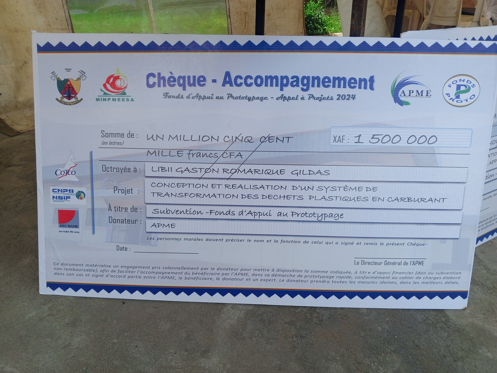
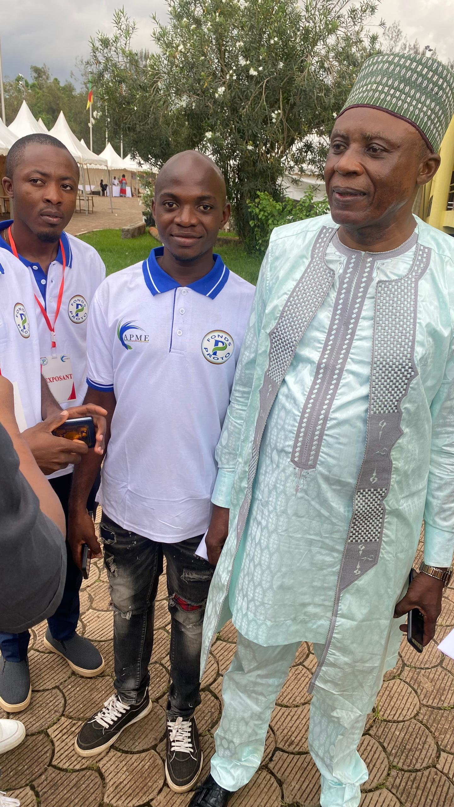
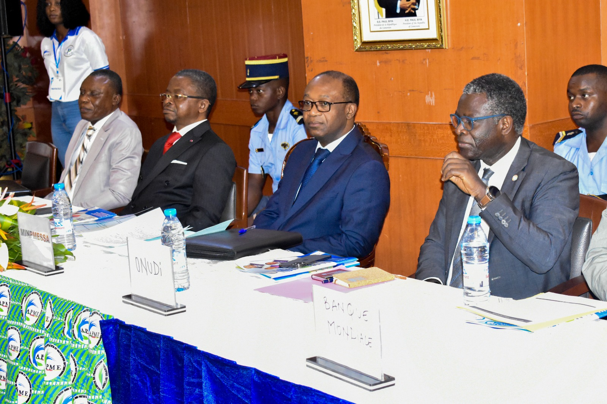
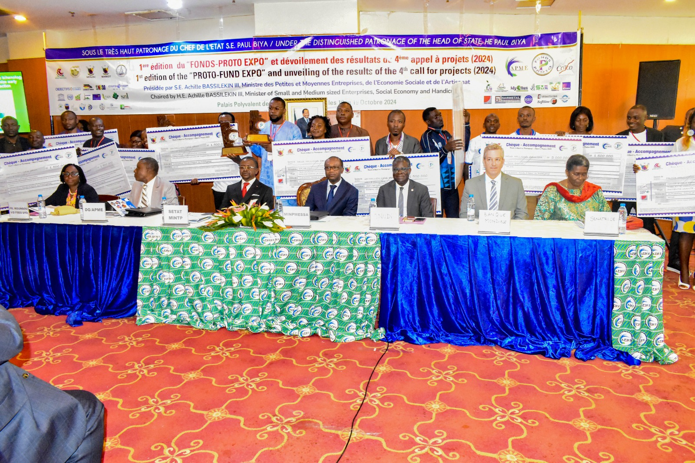

<!DOCTYPE html>
<html lang="fr">
<head>
    <meta charset="UTF-8">
    <meta name="viewport" content="width=device-width, initial-scale=1.0">
    <title>Éco-Fuel Cam | Valorisation des Déchets au Cameroun</title>
    
</head>
<body>
    <header>
        
Éco-Fuel Cam

    </header>

    <section class="hero">
        <h1>Éco-Fuel Cam : L'Innovation Verte du Cameroun</h1>
        
Projet technologique de conversion des déchets plastiques en carburants synthétiques (gazole, essence, gaz) par pyrolyse.

        <a href="mailto:gastonlibii55@gmail.com" class="btn">Nous contacter / Participer</a>
    </section>
    
    <section class="section" style="background: white;">
        <h2>Distinctions & Jalons du Projet</h2>
        

            <strong>🏆 Lauréat du 12e prix au Concours FOND PRO-TO</strong> organisé par l'APME (Agence de Promotion des PME) avec l'obtention d'une subvention d'amorçage de 1 500 000 XAF.
        

        

            <strong>🎓 Certification CentraleSupélec</strong> validée avec succès pour l'unité de compétences "Cadrer le projet".
        

    </section>

    <section class="section">
        <h2>Notre Avancement en Images</h2>
        
Développement du prototype technique et interventions de maintenance à Douala.

        
        

            

                
                
Développement de l'unité pilote de pyrolyse Éco-Fuel Cam.

            

            
            

                
                
Assemblage et tests thermiques sur les composants du réacteur.

            

            
            

                
                
Maintenance rigoureuse et raccordements électriques sécurisés.

            

            
            

                
                
Analyse et contrôle de la qualité du carburant synthétique produit.

            

        

    </section>
    
    <section class="section" style="background: white;">
        <h2>Expertise & Prochaines Étapes</h2>
        

            
Porté par un ingénieur en maintenance industrielle chevronné (fort de plus de 150 interventions réussies sur des générateurs CAT/Volvo, compresseurs d'air et armoires électriques), le projet allie rigueur industrielle et impact écologique.

             
            
📅 <strong>Étape majeure :</strong> Finalisation complète des optimisations du prototype et lancement de la phase élargie de tests planifiés pour le <strong>27 juin 2026</strong>.

        

    </section>
    
    <footer>
        
&copy; 2026 Éco-Fuel Cam - Douala, Littoral, Cameroun.

        
Propulsé par l'ingénierie locale au service de l'environnement.

    </footer>
</body>
</html>
footer { background: var(--dark); color: white; text-align: center; padding: 2.5rem 5%; margin-top: 2rem; font-size: 0.95rem; }
    </style>
</head>
<body>
    <header>
        
Éco-Fuel Cam

    </header>

    <section class="hero">
        <h1>Éco-Fuel Cam : L'Innovation Verte du Cameroun</h1>
        
Projet technologique de conversion des déchets plastiques en carburants synthétiques (gazole, essence, gaz) par pyrolyse.

        <a href="mailto:gastonlibii55@gmail.com" class="btn">Nous contacter / Participer</a>
    </section>
    
    <section class="section" style="background: white;">
        <h2>Distinctions & Jalons du Projet</h2>
        

            <strong>🏆 Lauréat du 12e prix au Concours FOND PRO-TO</strong> organisé par l'APME (Agence de Promotion des PME) avec l'obtention d'une subvention d'amorçage de 1 500 000 XAF.
        

        

            <strong>🎓 Certification CentraleSupélec</strong> validée avec succès pour l'unité de compétences "Cadrer le projet".
        

    </section>

    <section class="section">
        <h2>Notre Avancement en Images</h2>
        
Développement du prototype technique et interventions de maintenance à Douala.

        
        

            

                
                
Développement de l'unité pilote de pyrolyse Éco-Fuel Cam.

            

            
            

                
                
Assemblage et tests thermiques sur les composants du réacteur.

            

            
            

                
                
Maintenance rigoureuse et raccordements électriques sécurisés.

            

            
            

                
                
Analyse et contrôle de la qualité du carburant synthétique produit.

            

        

    </section>
    
    <section class="section" style="background: white;">
        <h2>Expertise & Prochaines Étapes</h2>
        

            
Porté par un ingénieur en maintenance industrielle chevronné (fort de plus de 150 interventions réussies sur des générateurs CAT/Volvo, compresseurs d'air et armoires électriques), le projet allie rigueur industrielle et impact écologique.

             
            
📅 <strong>Étape majeure :</strong> Finalisation complète des optimisations du prototype et lancement de la phase élargie de tests planifiés pour le <strong>27 juin 2026</strong>.

        

    </section>
    
    <footer>
        
&copy; 2026 Éco-Fuel Cam - Douala, Littoral, Cameroun.

        
Propulsé par l'ingénierie locale au service de l'environnement.

    </footer>
</body>
</html>
